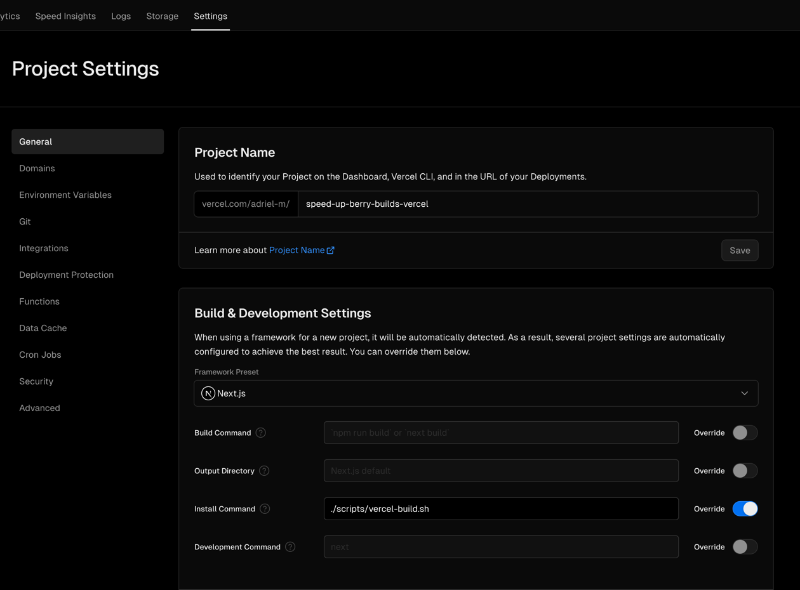

# TL;DR

Berry (yarn v2) isn’t completely supported by vercel[^VercelPackageManager]. While berry can be used to manage and build the project,
caching isn’t properly configured. To hack around the caching issue, we need to follow these two steps:

1. Set the `YARN_CACHE_FOLDER` environment variable[^YarnCacheFolder] to a place that gets cached by vercel[^VercelCaching].
2. Restore `.yarn/install-state.gz` which is used in the linking step[^YarnQA].

See the script that does all of these [here](#putting-it-all-together).

# Intro/Problem

This blog uses next.js and deployed to vercel. I didn’t create this blog from scratch and used this
[template](https://github.com/timlrx/tailwind-nextjs-starter-blog) to bootstrap this blog. I am also using
[TinaCMS](https://tina.io/) to manage the content for simple blog posts; it doesn’t fully support all the features I
want[^TinaLimitation], but that’s a different story.

The initial build time with just the template was 2 minutes 1 second where the fetch and link step took 1 minute 17
seconds. From here on out, I'll only be focusing on these two steps and will only mention these durations.
In my opinion, this is fine so far and optimizing the build didn't even cross my mind yet.

```console
➤ YN0000: ┌ Fetch step
➤ YN0066: │ typescript@patch:typescript@npm%3A5.3.2#~builtin<compat/typescript>::version=5.3.2&hash=14eedb: Cannot apply hunk #2
➤ YN0013: │ 54 packages were already cached, 1089 had to be fetched
➤ YN0000: └ Completed in 1m 13s
➤ YN0000: ┌ Link step
➤ YN0007: │ esbuild@npm:0.18.11 must be built because it never has been before or the last one failed
➤ YN0007: │ esbuild@npm:0.18.20 must be built because it never has been before or the last one failed
➤ YN0007: │ protobufjs@npm:7.2.5 must be built because it never has been before or the last one failed
➤ YN0007: │ contentlayer@npm:0.3.4 must be built because it never has been before or the last one failed
➤ YN0000: └ Completed in 3s 412ms
```

Now let's add TinaCMS[^TinaInstallation]. I've removed the `tinacms build` step and the `pages` folder as they require a valid tina client id and unused respectively
(the PR can be found [here](https://github.com/Adriel-M/speed-up-berry-builds-vercel/pull/2)). Wow, the fetch step is now 2 minutes
52 seconds and the linking step is 1 minute 6 seconds[^FullBuildLogs]. Why does it keep refetching the dependencies and why
isn't the linking step cached? Vercel has a finite amount of build minutes[^VercelPricing] and optimizing the build time might be
necessary if I actually end up posting frequently.

```console
➤ YN0000: ┌ Fetch step
➤ YN0066: │ typescript@patch:typescript@npm%3A5.3.2#~builtin<compat/typescript>::version=5.3.2&hash=14eedb: Cannot apply hunk #2
➤ YN0013: │ 56 packages were already cached, 1707 had to be fetched
➤ YN0000: └ Completed in 2m 52s
➤ YN0000: ┌ Link step
➤ YN0007: │ esbuild@npm:0.18.20 must be built because it never has been before or the last one failed
➤ YN0007: │ esbuild@npm:0.18.11 must be built because it never has been before or the last one failed
➤ YN0007: │ yarn@npm:1.22.21 must be built because it never has been before or the last one failed
➤ YN0007: │ better-sqlite3@npm:8.7.0 must be built because it never has been before or the last one failed
➤ YN0007: │ protobufjs@npm:7.2.5 must be built because it never has been before or the last one failed
➤ YN0000: │ better-sqlite3@npm:8.7.0 STDERR prebuild-install warn install /lib64/libm.so.6: version `GLIBC_2.29' not found (required by /vercel/path0/node_modules/better-sqlite3/build/Release/better_sqlite3.node)
... Truncated a bunch of linking steps for better-sqlite
➤ YN0000: │ better-sqlite3@npm:8.7.0 STDERR gyp info ok
➤ YN0007: │ contentlayer@npm:0.3.4 must be built because it never has been before or the last one failed
➤ YN0000: └ Completed in 1m 6s
```

To follow along, I will be linking GitHub PRs and providing relevant vercel build logs for each step. I'll also be adding an
empty commit right after each step to showcase the cache being hit/missed.

# Speeding Up the Build Step

## Preparation

We'll be overriding the install step on the vercel build pipeline. For now, it will just run the `yarn install` command.
We'll put this script in `scripts/vercel-build.sh`. Don't forget to `chmod +x` so it can be executed.

```shell title="scripts/vercel-build.sh" showLineNumbers
#!/bin/bash

echo "Starting the script..."

echo "Running 'yarn install --immutable'..."
yarn install --immutable

echo "Script completed."
```

To override the install step on vercel, go to `Settings > General` then override
`Build & Development Settings > Project Settings > Install Command`. Now toggle the override and put in the path
to the script file `./scripts/vercel-build.sh`.



PR can be found [here](https://github.com/Adriel-M/speed-up-berry-builds-vercel/pull/1).

## Upgrading Yarn

This project uses [corepack](https://github.com/nodejs/corepack) which allows us to specify which version of yarn controlled by the `packageManager` option
in `package.json`. At the moment, `yarn@3.6.1` is being used. Looking at the [changelog](https://github.com/yarnpkg/berry/blob/943a9f08936ee3f44441c2cc86351a9da6561fa8/CHANGELOG.md),
`performance` shows up a few times. Upgrading yarn should mean faster build times 🤔?

To upgrade the yarn version, run `yarn set version 4.1.0`. This changes the `packageManager` option in `package.json` and replaces the bundled
yarn cjs file. Don't forget to run `yarn install` which will update the `yarn.lock` file also update the `.yarnrc.yml` file
(notably `enableGlobalCache: false`).

This did cut down the fetching time back to around a minute but I still want to avoid refetching the dependencies.

```console
➤ YN0000: · Yarn 4.1.0
➤ YN0000: ┌ Resolution step
➤ YN0000: └ Completed in 0s 623ms
➤ YN0000: ┌ Post-resolution validation
➤ YN0060: │ next is listed by your project with version 14.1.0, which doesn't satisfy what next-contentlayer (pfca51) requests (^12.0.0 || ^13.0.0).
➤ YN0060: │ react is listed by your project with version 18.2.0, which doesn't satisfy what pliny (p1eae0) and other dependencies request (^17.0.2).
➤ YN0086: │ Some peer dependencies are incorrectly met; run yarn explain peer-requirements <hash> for details, where <hash> is the six-letter p-prefixed code.
➤ YN0000: └ Completed
➤ YN0000: ┌ Fetch step
➤ YN0013: │ 1707 packages were added to the project (+ 279.03 MiB).
➤ YN0000: └ Completed in 1m 8s
➤ YN0000: ┌ Link step
... Truncated
➤ YN0000: └ Completed in 53s 589ms
```

PR can be found [here](https://github.com/Adriel-M/speed-up-berry-builds-vercel/pull/3).

## Moving the Yarn Cache Folder

Looking at the supported package managers by vercel, only yarn classic is supported[^VercelPackageManager]. The `.yarn` folder isn't
cached[^VercelCaching] which contains the cache folder used by yarn[^YarnCacheFolder]. We need to set the yarn cache folder to a location that is cached
by vercel; for this project, we'll use `.next/cache` as that's cached[^VercelCaching].
We also need to set the `YARN_CACHE_FOLDER` environment variable[^YarnCacheFolder] when we run `yarn install`.

```shell title="scripts/vercel-build.sh" {5-7} showLineNumbers
#!/bin/bash

echo "Starting the script..."

# Set an environment variable YARN_CACHE_FOLDER=./.next/cache/yarn
echo "Setting environment variable YARN_CACHE_FOLDER=./.next/cache/yarn..."
export YARN_CACHE_FOLDER=./.next/cache/yarn

# Run yarn install --immutable
echo "Running 'yarn install --immutable'..."
yarn install --immutable

echo "Script completed."
```

Now the fetch step takes around 1 second. This means that we're not refetching the dependencies anymore! That is roughly
a minute of savings! It still looks like there are more improvements that can be made since the linking step wasn't skipped...

```console
➤ YN0000: · Yarn 4.1.0
➤ YN0000: ┌ Resolution step
➤ YN0000: └ Completed in 0s 628ms
➤ YN0000: ┌ Post-resolution validation
➤ YN0060: │ next is listed by your project with version 14.1.0, which doesn't satisfy what next-contentlayer (pfca51) requests (^12.0.0 || ^13.0.0).
➤ YN0060: │ react is listed by your project with version 18.2.0, which doesn't satisfy what pliny (p1eae0) and other dependencies request (^17.0.2).
➤ YN0086: │ Some peer dependencies are incorrectly met; run yarn explain peer-requirements <hash> for details, where <hash> is the six-letter p-prefixed code.
➤ YN0000: └ Completed
➤ YN0000: ┌ Fetch step
➤ YN0000: └ Completed in 0s 940ms
➤ YN0000: ┌ Link step
... Truncated
➤ YN0000: └ Completed in 50s 759ms
```

PR can be found [here](https://github.com/Adriel-M/speed-up-berry-builds-vercel/pull/4).

## Caching the Linking Step

Looking at this [GitHub discussion](https://github.com/yarnpkg/berry/discussions/4978#discussioncomment-7251866), it looks
like caching `.yarn/install-state.gz` is what we want to do. The yarn docs state[^YarnQA]:

> .yarn/install-state.gz is an optimization file that you shouldn't ever have to commit. It simply stores the exact
> state of your project so that the next commands can boot without having to resolve your workspaces all over again.

It doesn't explicitly mention how it stores the linking step information, but it sounds legit. We can't set the location
of this file just like the previous section with an environment variable, but we can copy it to and from a cached folder
during the install step. To do this, we'll check if this file exists in `node_modules` and copy it to `.yarn`. Inversely copy it
from `.yarn` back to `node_modules` after `yarn install` so it can be cached for future builds.

```shell title="scripts/vercel-build.sh" {5-11,21-27} showLineNumbers
#!/bin/bash

echo "Starting the script..."

# Check if node_modules/install-state.gz exists and copy it to .yarn/install-state.gz
if [ -f "node_modules/install-state.gz" ]; then
    echo "Copying node_modules/install-state.gz to .yarn/install-state.gz..."
    cp node_modules/install-state.gz .yarn/install-state.gz
else
    echo "node_modules/install-state.gz does not exist. Skipping copy."
fi

# Set an environment variable YARN_CACHE_FOLDER=./.next/cache/yarn
echo "Setting environment variable YARN_CACHE_FOLDER=./.next/cache/yarn..."
export YARN_CACHE_FOLDER=./.next/cache/yarn

# Run yarn install --immutable
echo "Running 'yarn install --immutable'..."
yarn install --immutable

# Check if .yarn/install-state.gz exists and copy it to node_modules/install-state.gz
if [ -f ".yarn/install-state.gz" ]; then
    echo "Copying .yarn/install-state.gz back to node_modules/install-state.gz..."
    cp .yarn/install-state.gz node_modules/install-state.gz
else
    echo ".yarn/install-state.gz does not exist. Skipping copy."
fi

echo "Script completed."
```

Looks like that did it! Another minute cut down from the build time.

```console
➤ YN0000: · Yarn 4.1.0
➤ YN0000: ┌ Resolution step
➤ YN0000: └ Completed in 0s 635ms
➤ YN0000: ┌ Post-resolution validation
➤ YN0060: │ next is listed by your project with version 14.1.0, which doesn't satisfy what next-contentlayer (pfca51) requests (^12.0.0 || ^13.0.0).
➤ YN0060: │ react is listed by your project with version 18.2.0, which doesn't satisfy what pliny (p1eae0) and other dependencies request (^17.0.2).
➤ YN0086: │ Some peer dependencies are incorrectly met; run yarn explain peer-requirements <hash> for details, where <hash> is the six-letter p-prefixed code.
➤ YN0000: └ Completed
➤ YN0000: ┌ Fetch step
➤ YN0000: └ Completed in 0s 939ms
➤ YN0000: ┌ Link step
➤ YN0000: └ Completed in 1s 185ms
➤ YN0000: · Done with warnings in 3s 309ms
```

PR can be found [here](https://github.com/Adriel-M/speed-up-berry-builds-vercel/pull/5).

## Putting It All Together

This is what the final script looks like that copies the `install-state.gz`, set the `YARN_CACHE_FOLDER` environment
variable, runs `yarn install`, and copies back the `install-state.gz` to a cacheable folder:

```shell title="scripts/vercel-build.sh" showLineNumbers
#!/bin/bash

echo "Starting the script..."

# Check if node_modules/install-state.gz exists and copy it to .yarn/install-state.gz
if [ -f "node_modules/install-state.gz" ]; then
    echo "Copying node_modules/install-state.gz to .yarn/install-state.gz..."
    cp node_modules/install-state.gz .yarn/install-state.gz
else
    echo "node_modules/install-state.gz does not exist. Skipping copy."
fi

# Set an environment variable YARN_CACHE_FOLDER=./.next/cache/yarn
echo "Setting environment variable YARN_CACHE_FOLDER=./.next/cache/yarn..."
export YARN_CACHE_FOLDER=./.next/cache/yarn

# Run yarn install --immutable
echo "Running 'yarn install --immutable'..."
yarn install --immutable

# Check if .yarn/install-state.gz exists and copy it to node_modules/install-state.gz
if [ -f ".yarn/install-state.gz" ]; then
    echo "Copying .yarn/install-state.gz back to node_modules/install-state.gz..."
    cp .yarn/install-state.gz node_modules/install-state.gz
else
    echo ".yarn/install-state.gz does not exist. Skipping copy."
fi

echo "Script completed."
```

# Conclusion

This took me longer than I wanted and did a lot of trial and error. It was especially painful waiting 4+ minutes for
each potential solution I wanted to test out. I could have downgraded to yarn classic as well, but where's the fun in that? Another thing I want to test out
is [turborepo](https://turbo.build/) and see if that would speed up the build times.

[^VercelPackageManager]:
    Vercel determines which package manager is being used by the committed lock file. While yarn is supported,
    only v1 is on the supported package manager table and not the next generation of yarn (berry). See the vercel documentation
    [here](https://vercel.com/docs/deployments/builds/package-managers#supported-package-managers).

[^YarnCacheFolder]:
    The yarn cache folder by default is `./.yarn/cache`. To override this, an environment vartiable can be set
    which will be the snake case of the config key. See the yarnrc documentation [here](https://yarnpkg.com/configuration/yarnrc#cacheFolder).

[^YarnQA]:
    It’s not clear how `install-state.gz` is used by yarn from the QA section of the yarn documentation
    [here](https://yarnpkg.com/getting-started/qa#which-files-should-be-gitignored).
    This [GitHub discussion](https://github.com/yarnpkg/berry/discussions/4978#discussioncomment-7251866) suggests it is used in
    the linking step as deleting it will result in running that step again.

[^TinaLimitation]:
    TinaCMS has been great for very simple posts that only contain markdown. It falls short once you do more advance stuff
    supported by MDX such as inlining JSX components. It also doesn't support [footnotes](https://tina.io/docs/reference/types/rich-text/#unsupported-elements).

[^TinaInstallation]:
    To install TinaCMS to an existing project, follow these steps from their
    [documentation](https://tina.io/docs/frameworks/other/).

[^FullBuildLogs]:
    I've truncated the build logs since it contained a lot of lines for linking better-sqlite. The
    un-truncated logs can be found [here](https://gist.github.com/Adriel-M/856546e5a064aeb55916dffbdbae9fe1).

[^VercelPricing]: At the time of this writing, vercel has 6000 minutes on the hobby plan. Check the pricing page [here](https://vercel.com/pricing).

[^VercelCaching]:
    For our project, only `node_modules`, `.next/cache`, and `yarn.lock` are cached. Check out the vercel documentation on which folders are cached
    [here](https://vercel.com/docs/deployments/troubleshoot-a-build#what-is-cached).
