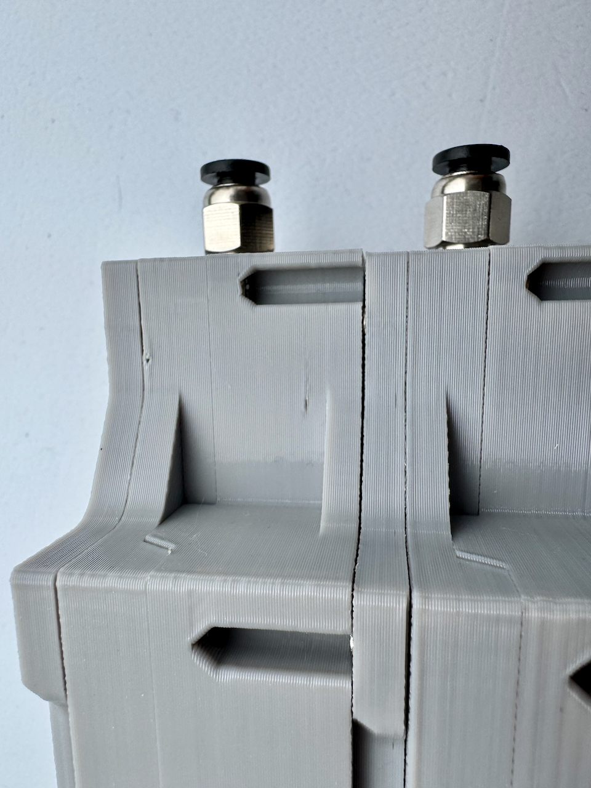
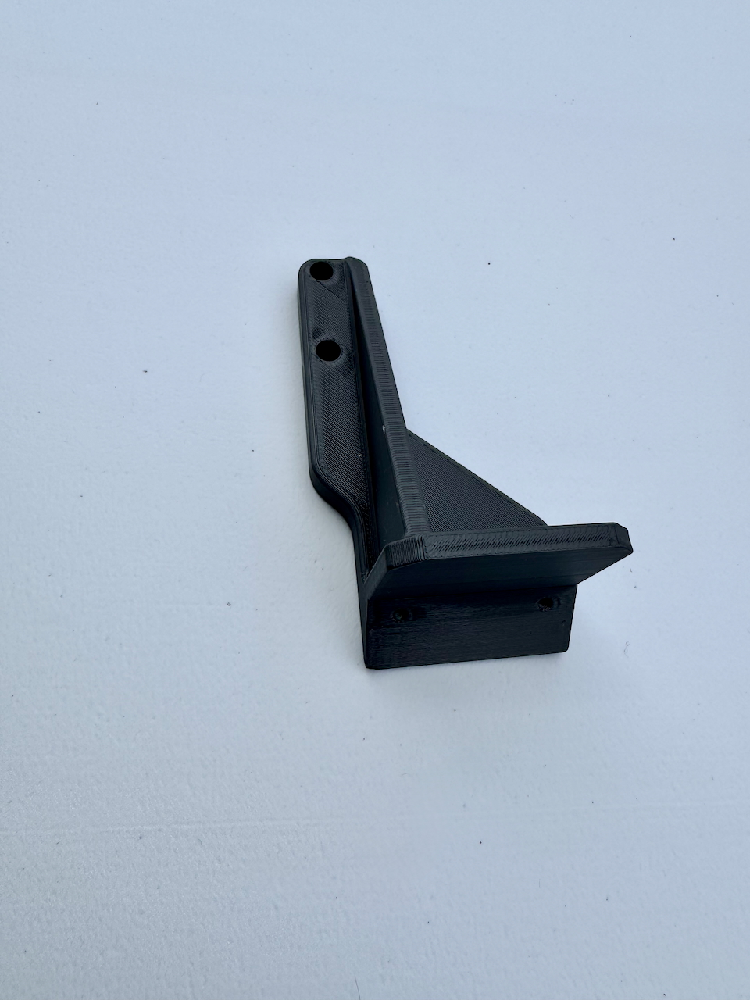
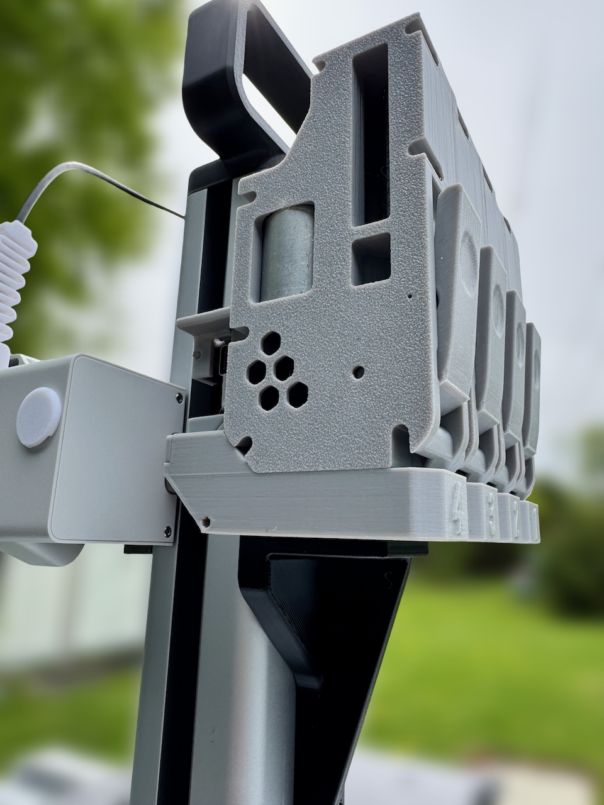
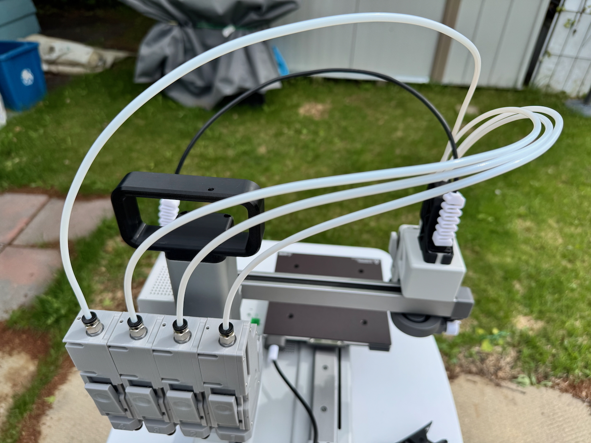
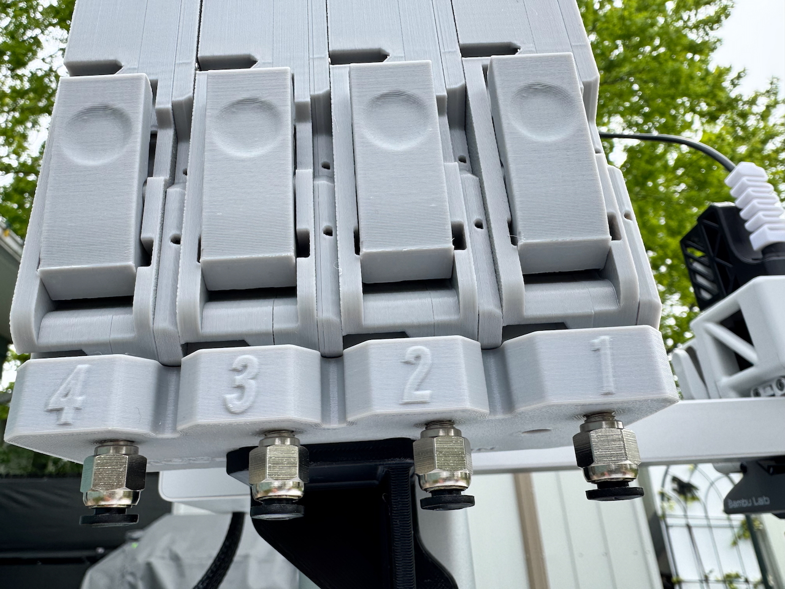
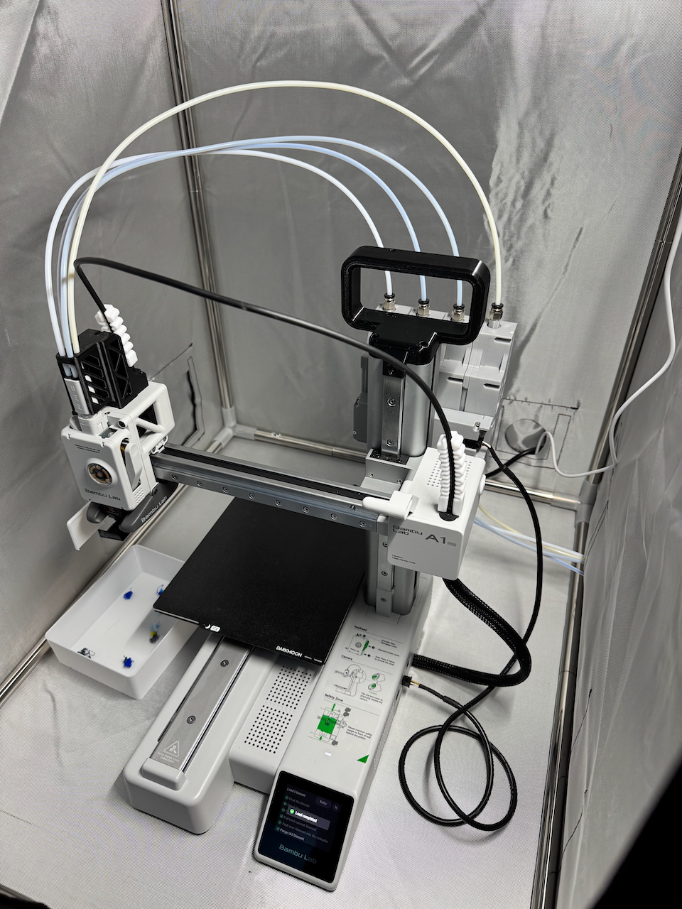
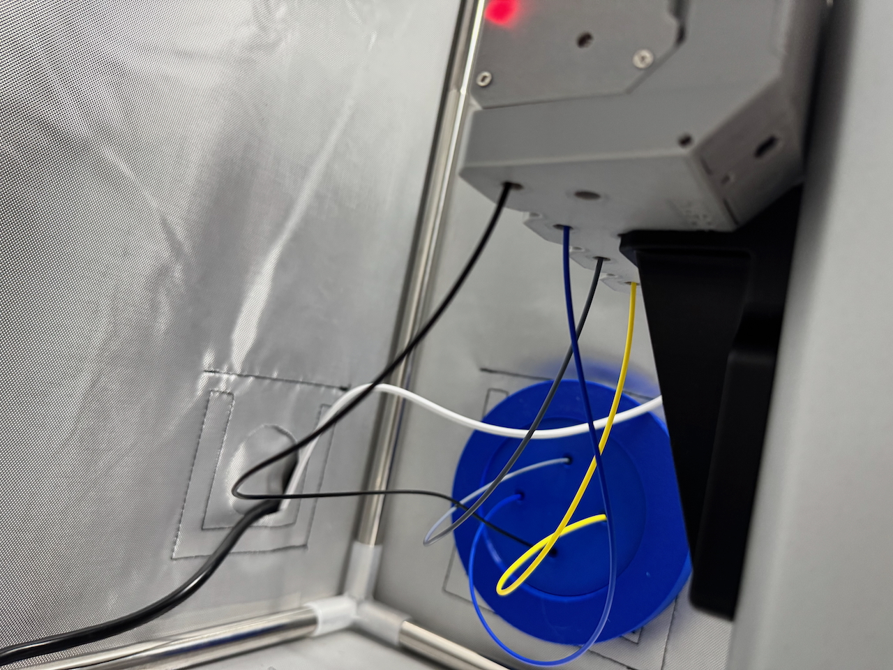

# Unboxing

Received the BMCU from triangle labs. I opted for the fully assembled option since I didn't have time and equipment
to assemble it. I paid around $210 CAD, shipping and taxes included, still saving me $100+ compared to buying the ams
lite (at the time, it costs $319 without tax and shipping directly from bambu labs).

## Contents

The contents of the package:

- Preassembled BMCU unit
- Cable to connect to the A1 Mini
- PTFE tubing + cutter
- PTFE coupler
- Screws + Optical Balls?[^OpticalVersion]
- Sample multi-colour print

<Gallery images={import.meta.glob('./package-content/*')} />

## Main Unit

Closeups of the main bmcu unit.

<Gallery images={import.meta.glob('./bmcu-closeups/*')} />

There are some minor print imperfections:

# Installation

Printed this [mount](https://makerworld.com/en/models/1299607-a1-mini-bmcu-370-x-rear-mount?from=search#profileId-1331669)
in PETG, mounted to where the stock spool holder would have been installed to at the backside of the printer.

Then install the PTFE tubes from the bmcu unit into the A1 mini filament hub.

# Initial Thoughts

It works great! It behaves and performs exactly like an AMS. Operationally, it was cumbersome loading filament when
using an intake ptfe tube (from filament to bmcu).

The process of loading the filament is to push the filament through while pressing on the lever to unblock the filament
path. Having a ptfe tube installed makes it hard to do both actions at once, resulting in me uninstalling the ptfe tube
from the coupler, loading the filament, then installing the ptfe tube again. Instead, I switched to having an uncovered
filament entering into the bmcu unit and removing the ptfe couplers. There have been no tangles so far
:crossed_fingers:.

Overall, works great! I do worry about bambu labs blocking this in the future though.

[^OpticalVersion]:
    I'm not sure what these are for. The documentation that came with the kit states: "If you insist on
    modifying it into a daughter board like the official one, the kit comes with four ITR9606 optical inerruptors [sic]."
    You can find the documentation [here](https://drive.google.com/drive/folders/1jqqc9Y022vgRqmMLEvtZ8C7h0OYcpuZb).
