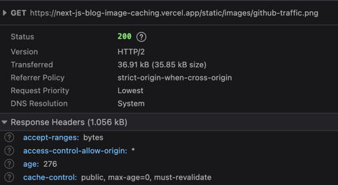
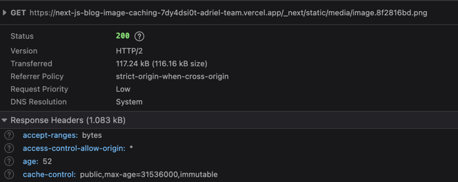

> [!Warning]
> The steps here rely on webpack to bundle the images. This still works with Next.js 15 (as of 2025-04-17) but I
> am not sure if this will work on future versions/and the switch to turbo.

> [!Note]
> For the examples in this post, I have intentionally set `optimization: false` in `next.config.js > images` to minimize
> confusion with the generated paths when using the image optimization at vercel. The cache behaviour is still the same
> whether optimization is on or off.

# TL;DR

1. Files in the `public` folder doesn't have a long `cache-control: max-age`.
2. Use webpack to bundle images into the Next.js build.
3. Serve bundled images instead to have a properly configured `cache-control: max-age`.

# Intro/Problem

This blog uses Next.js and mdx-js[^MdxJs] to display content. The syntax for using an image in markdown is as follows:

```

```

For the `/asset/path`, the path to the image isn't a path in the filesystem but a website path (usually a path to a static
asset in the public folder[^NextJsStaticAssets]). The issue with this, stated in their [documentation](https://nextjs.org/docs/app/building-your-application/optimizing/static-assets#caching):

> Next.js cannot safely cache assets in the public folder because they may change. The default caching headers applied are:

Resulting in the served image to have this header: `cache-control: public, max-age=0, must-revalidate`. This can be reproduced by going to this [page](https://next-js-blog-image-caching.vercel.app/blog/release-of-tailwind-nextjs-starter-blog-v2.0),
opening the browser console, and scrolling down enough to trigger the lazy fetch of the image.[^UncachedSource]



While intuitively, the website content can not change
in the same deploy (assuming we're not fetching dynamic data and all content is static), the urls to the assets will be
the same across deploys.

For example:

1. 2 deploys, `deployA` and `deployB`.
2. 2 versions of an image with the same name but have two different hashes, `hashA` and `hashB`, both accessible at `/images/image.png`

Suppose we visit the site during `deployA` then update the image in `deployB` with a new version of the image with `hashB`.
If the image path did not change and still accessible at `/images/image.png` and had a big `Cache-Control: max-age`,
the browser will not know there is a new version of the image and would serve the stale image `hashA` instead.

Next.js can bundle the image instead by using `import` and passing it to the `Image` component.

```typescript title="test/page.tsx" {3,8} showLineNumbers
import Image from 'next/image'

import imageContent from './image.png'

export default function About() {
  return (
    <Image
      src={imageContent}
      ...
    />
  )
}
```

Now when visiting a [page](https://next-js-blog-image-caching-7dy4dsi0t-adriel-team.vercel.app/test) with a statically imported
image, the cache header of the image is now `cache-control
public,max-age=31536000,immutable`.[^StaticImportSource]



The image is now served from `/_next/static/media/image.8f2816bd.png`. Notice that the image path is not in the top level `static` folder
but now in a folder in `_next` (which means we're serving a bundled image now). Also note that the file name is different
and will contain a hash to differentiate different versions of the image (resolving the same path concern when using the `public` folder).

# Solution

The solution is to serve the bundled image instead of an image in the `public` folder. There are two problems to solve:

1. How do we bundle the images since we're not working with `jsx` files but with `mdx` files?
2. What do we pass into our `Image` component?

The PR to the solution can be found [here](https://github.com/Adriel-M/next-js-blog-image-caching/pull/1/files).

## Using Webpack to Bundle the Images

We'll be using webpack to bundle our images located in the `public/static/images` folder (or wherever your images are in the `public` folder.
The images don't have to be in the `public` folder in the end, but if you have an existing blog, you won't need to update the existing posts.

```typescript title="lib/Images.ts" showLineNumbers
import RequireContext = __WebpackModuleApi.RequireContext
const importFromFolder = (context: RequireContext) => {
  const images: Record<string, { default: { src: string } }> = {}

  for (const key of context.keys()) {
    if (!key.startsWith('public/static/images')) continue

    const newKey = key.replace('public/static/images', '/static/images')
    images[newKey] = context(key)
  }

  return images
}

const getImages = () => {
  const context = require.context('../public/static/images', true, /\.(png|jpe?g|svg|webp)$/)
  const keyToModule = importFromFolder(context)
  const keyToPath: Record<string, string> = {}

  for (const [key, value] of Object.entries(keyToModule)) {
    keyToPath[key] = value.default.src
  }

  return keyToPath
}

export default getImages()
```

### Creating a Context

```typescript title="lib/Images.ts" {16} showLineNumbers
import RequireContext = __WebpackModuleApi.RequireContext
const importFromFolder = (context: RequireContext) => {
  const images: Record<string, { default: { src: string } }> = {}

  for (const key of context.keys()) {
    if (!key.startsWith('public/static/images')) continue

    const newKey = key.replace('public/static/images', '/static/images')
    images[newKey] = context(key)
  }

  return images
}

const getImages = () => {
  const context = require.context('../public/static/images', true, /\.(png|jpe?g|svg|webp)$/)
  const keyToModule = importFromFolder(context)
  const keyToPath: Record<string, string> = {}

  for (const [key, value] of Object.entries(keyToModule)) {
    keyToPath[key] = value.default.src
  }

  return keyToPath
}

export default getImages()
```

We need to call `require.context()`[^RequireContextDocumentation] and this allows us to dynamically call `require` on multiple files in the target folder.
The first parameter is the folder to look into; our images are in `../public/static/images`.
The second parameter is a flag on whether to recurse into the subdirectories. Lastly, the last parameter is a regex expression to filter for only
png, jpg, jpeg, svg, and webp.

### Resolving Dependencies

```typescript title="lib/Images.ts" {2-13,17} showLineNumbers
import RequireContext = __WebpackModuleApi.RequireContext
const importFromFolder = (context: RequireContext) => {
  const images: Record<string, { default: { src: string } }> = {}

  for (const key of context.keys()) {
    if (!key.startsWith('public/static/images')) continue

    const newKey = key.replace('public/static/images', '/static/images')
    images[newKey] = context(key)
  }

  return images
}

const getImages = () => {
  const context = require.context('../public/static/images', true, /\.(png|jpe?g|svg|webp)$/)
  const keyToModule = importFromFolder(context)
  const keyToPath: Record<string, string> = {}

  for (const [key, value] of Object.entries(keyToModule)) {
    keyToPath[key] = value.default.src
  }

  return keyToPath
}

export default getImages()
```

Given our `context`, we would actually need to import our resource by calling `context()` on a key[^ContextKey].

This is a sample of the keys when calling `context.keys()`:

```
[
  './2024-02-09-speeding-up-builds-for-berry-yarn-projects-on-vercel/override-install.png',
  './2025-04-17-properly-caching-images-in-your-mdx-based-nextjs-blog/static-import.png',
  './2025-04-17-properly-caching-images-in-your-mdx-based-nextjs-blog/uncached-image.png',
  'public/static/images/2024-02-09-speeding-up-builds-for-berry-yarn-projects-on-vercel/override-install.png',
  'public/static/images/2025-04-17-properly-caching-images-in-your-mdx-based-nextjs-blog/static-import.png',
  'public/static/images/2025-04-17-properly-caching-images-in-your-mdx-based-nextjs-blog/uncached-image.png'
]
```

Note, images appear twice, first time is a relative path to the folder passed into `require.context` and the second
is an absolute path from the project directory. We filter out duplicates by checking if the key is the absolute path.
Afterwards, we call `context(key)` to actually import the image and create a map from path to module. Note, we're also
removing `public` from the path as we want image paths from the `mdx` file to match (which will be evident in the [future section](#rewriting-the-path-in-the-image-component)).

### Creating a Map of Markdown Image Path to Bundle Path

```typescript title="lib/Images.ts" {18-24} showLineNumbers
import RequireContext = __WebpackModuleApi.RequireContext
const importFromFolder = (context: RequireContext) => {
  const images: Record<string, { default: { src: string } }> = {}

  for (const key of context.keys()) {
    if (!key.startsWith('public/static/images')) continue

    const newKey = key.replace('public/static/images', '/static/images')
    images[newKey] = context(key)
  }

  return images
}

const getImages = () => {
  const context = require.context('../public/static/images', true, /\.(png|jpe?g|svg|webp)$/)
  const keyToModule = importFromFolder(context)
  const keyToPath: Record<string, string> = {}

  for (const [key, value] of Object.entries(keyToModule)) {
    keyToPath[key] = value.default.src
  }

  return keyToPath
}

export default getImages()
```

Lastly, we need to get the bundled path and create another map of markdown image path to bundled path.
The bundled path can be found in the `default.src` of the module.

A sample map:

```
{
  '/public/static/images/2024-02-09-speeding-up-builds-for-berry-yarn-projects-on-vercel/override-install.png': '/_next/static/media/override-install.fdc421dc.png',
  '/public/static/images/2025-04-17-properly-caching-images-in-your-mdx-based-nextjs-blog/static-import.png': '/_next/static/media/static-import.0584634a.png',
  '/public/static/images/2025-04-17-properly-caching-images-in-your-mdx-based-nextjs-blog/uncached-image.png': '/_next/static/media/uncached-image.f71858f9.png'
}
```

### Caveat

Since we are dynamically importing everything in our images folder, we might import an image that is not used in
any post. Even though it's not used, the image will still be part of the bundle and will not be tree shaked!

## Rewriting the Path in the Image Component

Now we need to use the bundled path instead of the path to original path in our `Image` component.

```typescript title="components/Image.tsx" showLineNumbers
import NextImage, { ImageProps } from 'next/image'

import images from '../lib/Images'

const Image = ({ src, ...rest }: ImageProps) => {
  if (typeof src === 'string' && src.startsWith('/static/images/')) {
    const imageSrc = images[src]
    // do a static import since we're not putting images in the public folder
    return <NextImage src={imageSrc} {...rest}  />
  }
  return <NextImage src={src} {...rest} />
}

export default Image
```

We create a wrapper around `NextImage` and check if the passed in `src` is of a path into `/static/images`. If it is,
we know it is bundled from the first step and pass in the resolved path instead.

> [!Note]
> You would need to pass in this component instead of the NextImage component to the `mdx-js` compiler.
> That step is not included in this blog post.

## Results

If you did everything right, the image being served is the bundled image and not the image in the `public` folder.
Now when visiting a [page](https://next-js-blog-image-caching-nbej0gc4d-adriel-team.vercel.app/blog/release-of-tailwind-nextjs-starter-blog-v2.0)
that is serving a bundled image, the cache header is now `cache-control: public,max-age=31536000,immutable`.[^BundledImageSource]


# Conclusion

This wasn't a straight forward process and I wish this was just a configuration for Next.js. I did try using a middleware
to add this `cache-control` header a year ago but that didn't work. I also need to check if this solution works when
`turbo` is used :sweat_smile:. Now to address the problem of bundling images that aren't displayed anymore, I am thinking
of using [remark-copy-linked-files](https://github.com/sergioramos/remark-copy-linked-files).

[^MdxJs]: A library that allows using JSX inside markdown files. For more info, check out their [website](https://mdxjs.com/).

[^NextJsStaticAssets]:
    Static assets can be placed in the `public` folder in the root of the project. To access the resource,
    for example `public/images/asset.png`, you would visit `https://<domain>/images/asset.png`. Note that `public` isn't part
    of the path. For more info, check out the [next.js documentation](https://nextjs.org/docs/app/building-your-application/optimizing/static-assets).

[^UncachedSource]: The source of this site can be found [here](https://github.com/Adriel-M/next-js-blog-image-caching) in the `main` branch.

[^StaticImportSource]:
    The source of this site can be found [here](https://github.com/Adriel-M/next-js-blog-image-caching/tree/static-imported-image) which is in the `static-imported-image` branch.
    This [PR](https://github.com/Adriel-M/next-js-blog-image-caching/pull/2/files) contains the relevant commits.

[^RequireContextDocumentation]: The documentation for `require.context` can be found [here](https://webpack.js.org/guides/dependency-management/#requirecontext).

[^ContextKey]: An example of this can be found [here](https://webpack.js.org/guides/dependency-management/#context-module-api).

[^BundledImageSource]:
    The source of this site can be found [here](https://github.com/Adriel-M/next-js-blog-image-caching/tree/webpack-bundle) which is in the `webpack-bundle` branch.
    This [PR](https://github.com/Adriel-M/next-js-blog-image-caching/pull/1/files) contains the relevant commits.
